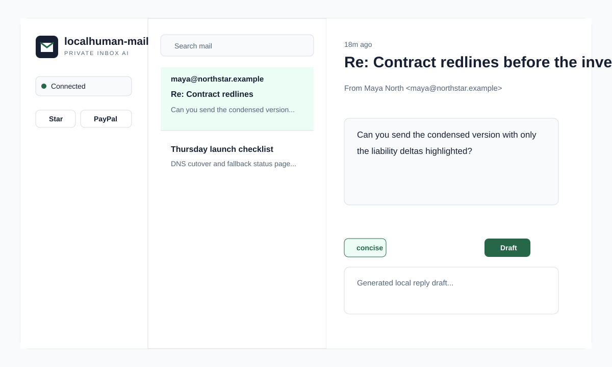
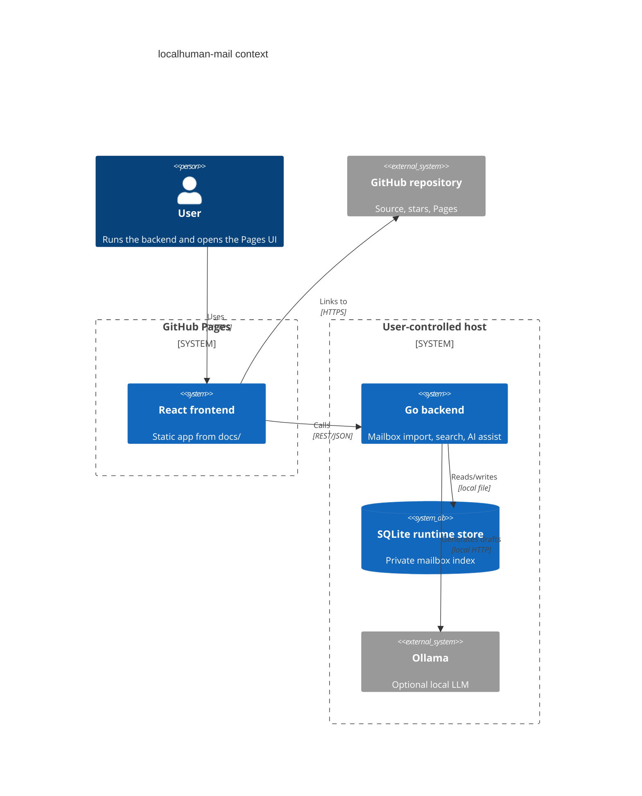

# localhuman-mail


Live app: https://baditaflorin.github.io/localhuman-mail/

Repository: https://github.com/baditaflorin/localhuman-mail

Support development: https://www.paypal.com/paypalme/florinbadita

localhuman-mail is a privacy-first email workbench that gives you fast search, local mailbox import, and local-AI reply drafting without handing a hosted service your inbox.



## Quickstart

```bash
git clone https://github.com/baditaflorin/localhuman-mail.git
cd localhuman-mail
npm --prefix frontend install
make install-hooks
make dev
```

The frontend runs with Vite in development and builds into `docs/` for GitHub Pages. The backend listens on `http://localhost:8080` by default.

## Verified Features

- GitHub Pages frontend with repo, PayPal, version, and commit metadata visible in the UI (`frontend/e2e/app.spec.ts`).
- Go backend with `/healthz`, `/readyz`, `/metrics`, `/api/v1/version`, mailbox import, search, and reply assist (`scripts/smoke.sh`).
- Real `.eml` import through picker, drag/drop, paste, clipboard, and multi-file batch paths; parser fixtures live in `test/fixtures/realdata/`.
- JSON, CSV, state-file, share-link, print, body-copy, and draft-copy output paths (`frontend/src/features/mail/workbench.test.ts`, `frontend/e2e/app.spec.ts`).
- Versioned UI state persistence for backend URL, query, selected message, tone, draft, paste text, and explicit imported snapshots.
- Local LLM reply assist through Ollama, with a local template fallback.
- Capability detection for `readpst`, libmagic via `file`, Tantivy CLI, sentence-transformers, `age`, SQLite, and Ollama.
- Docker Compose production topology with nginx on public host port `25342`.

## Architecture



More detail: docs/architecture.md

ADRs: docs/adr/

Deployment: deploy/README.md

API: docs/api.md and api/openapi.yaml

## Commands

```bash
make help
make build
make test
make smoke
make docker-build
```

## Current Limitations

- PST, Maildir, IMAP sync, Tantivy indexing, sentence-transformer ranking, and `age` encryption are capability boundaries, not finished UI workflows.
- Attachment contents are detected as metadata but not indexed or opened.
- Share URLs are intended for small filtered snapshots; larger sessions should use `Export state`.
- The GitHub Pages frontend never stores mailbox credentials. Browser state can contain mailbox content only after an explicit state import/share/export action.

## Configuration

Copy `.env.example` for local backend values. Never commit real `.env` files, mailbox data, private keys, or credentials.

Frontend build-time variables are public. Do not put secrets in `VITE_*` variables.

## GitHub Pages Publishing

Pages is configured from `main` branch `/docs` folder.

Live URL: https://baditaflorin.github.io/localhuman-mail/

`make build` regenerates the frontend into `docs/`, including hashed assets and `404.html`.

## Security

No mailbox contents, credentials, tokens, or private keys belong in git. The frontend stores only non-sensitive UI settings. Mailbox contents stay in the backend runtime volume.

Security policy: SECURITY.md
