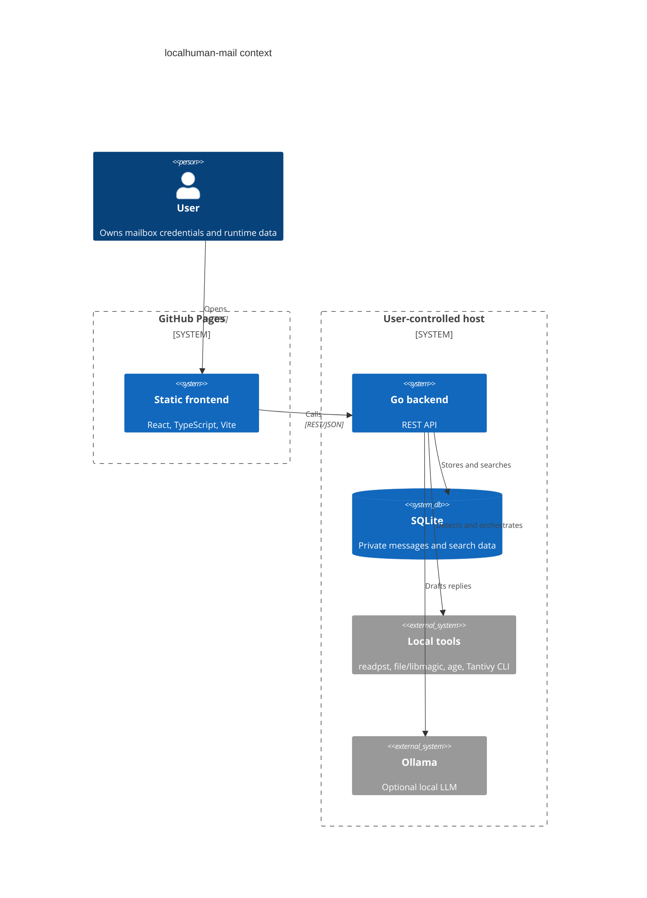
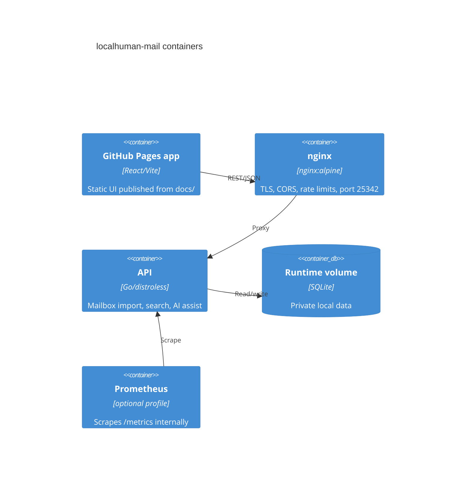

# Architecture

Live frontend: https://baditaflorin.github.io/localhuman-mail/

Repository: https://github.com/baditaflorin/localhuman-mail

## Context

## Containers

## Boundaries

- `frontend/` is public and static.
- `docs/` is the GitHub Pages publish directory.
- `cmd/server/` is the backend entry point.
- `internal/api/` exposes HTTP handlers.
- `internal/mailbox/` parses imported messages.
- `internal/search/` owns runtime storage and fallback search.
- `internal/ai/` owns local LLM integration.
- `deploy/` owns server deployment files.

